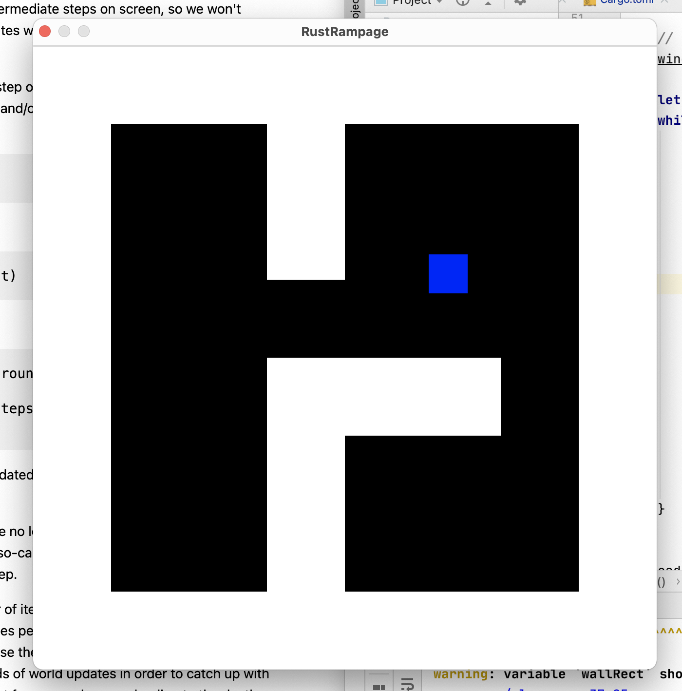

# RustRampage
RetroRampage for Rust

Learning Rust by following https://github.com/nicklockwood/RetroRampage and implement it in Rust.

Decided to use https://github.com/emoon/rust_minifb because it seems to be simple enough.

## Installation

* `git clone https://github.com/baumhoto/RustRampage.git`

* `cd RustRampage`

* `cargo run`

